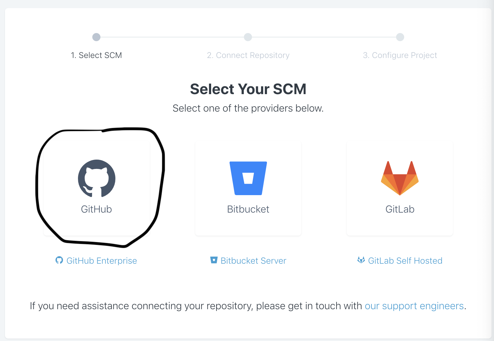
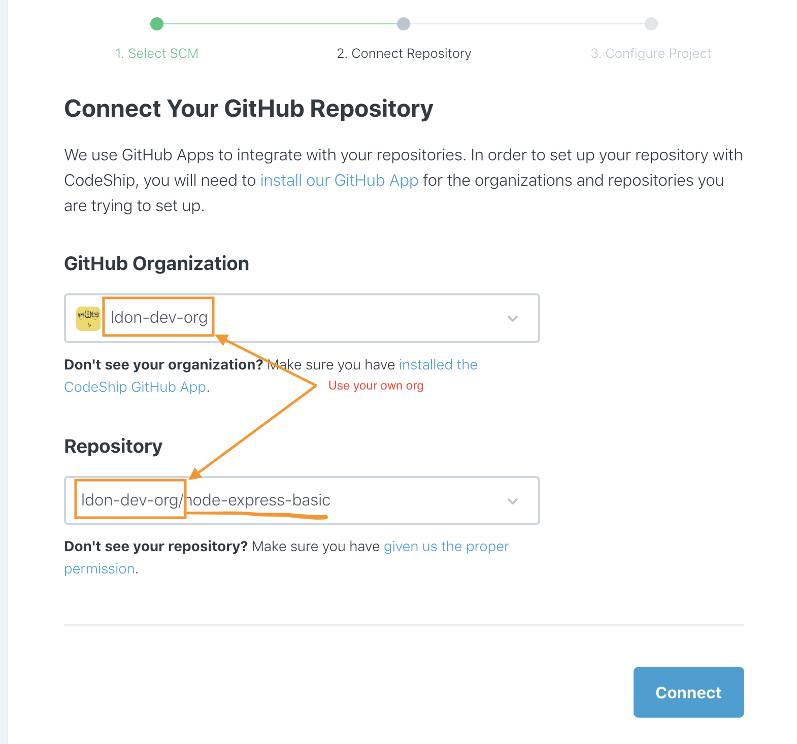
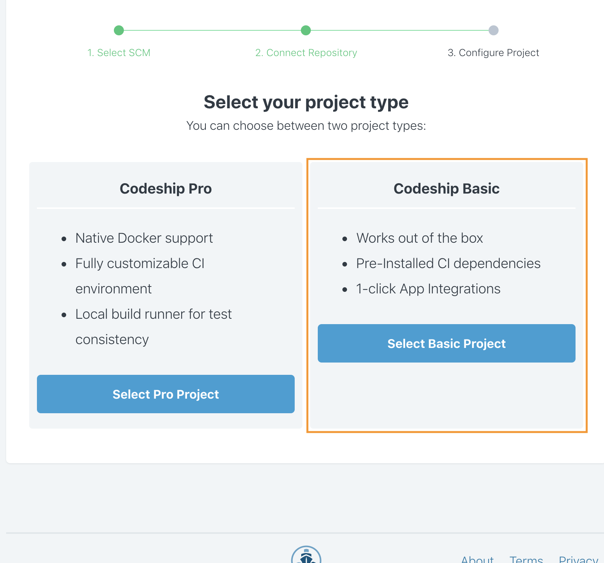
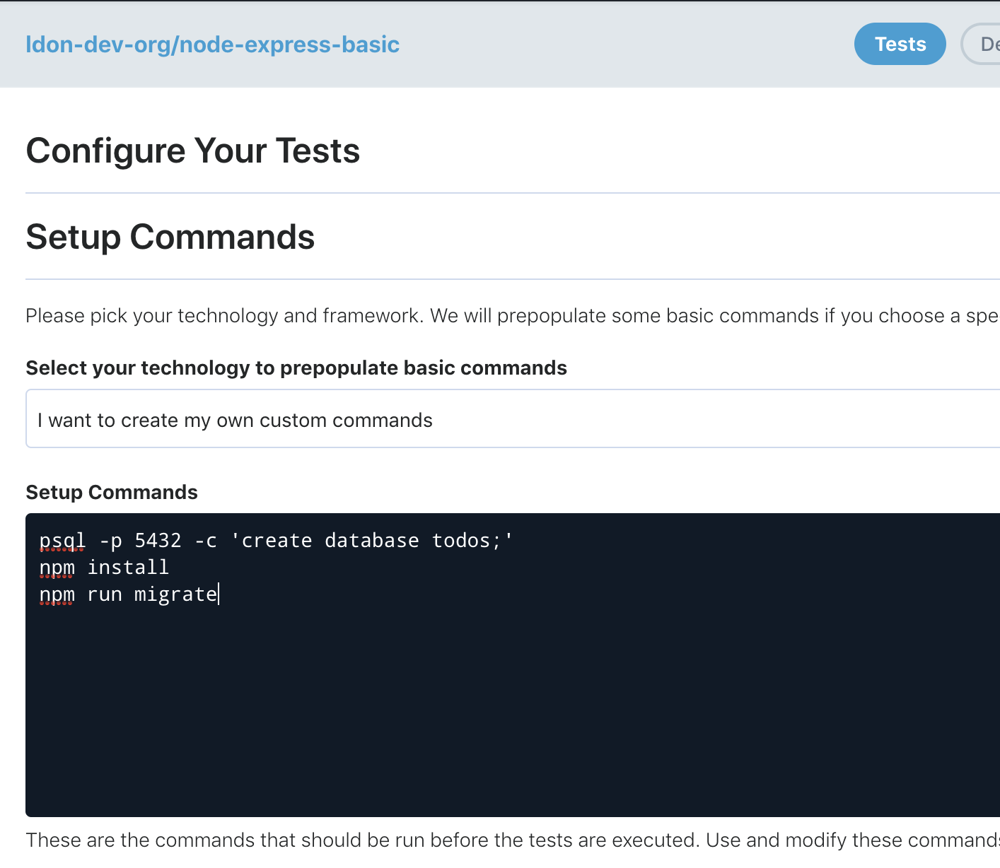
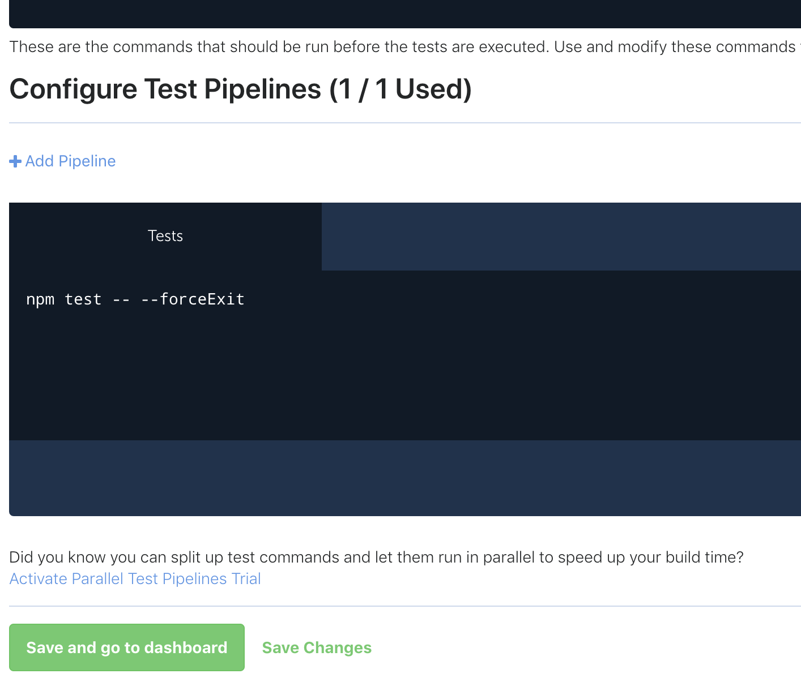
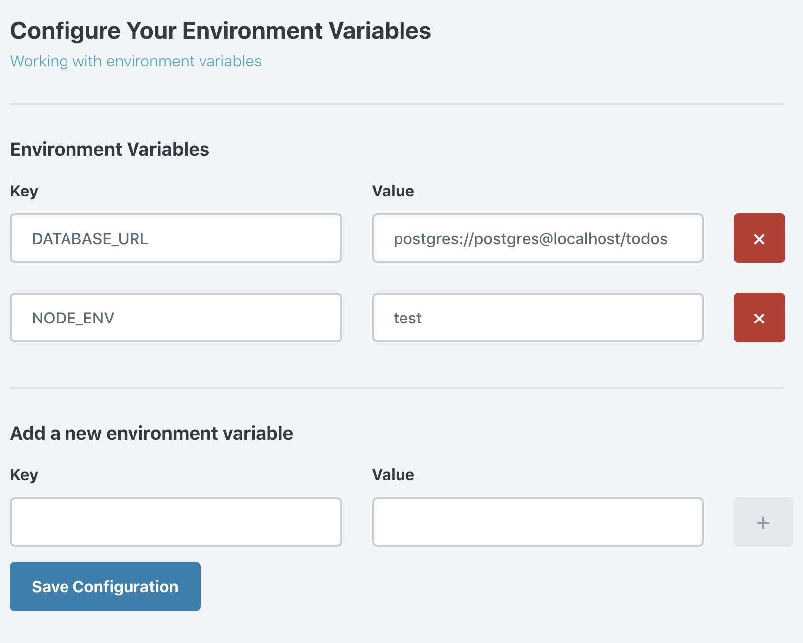
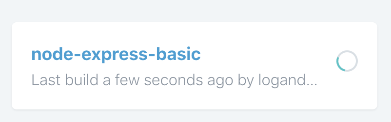
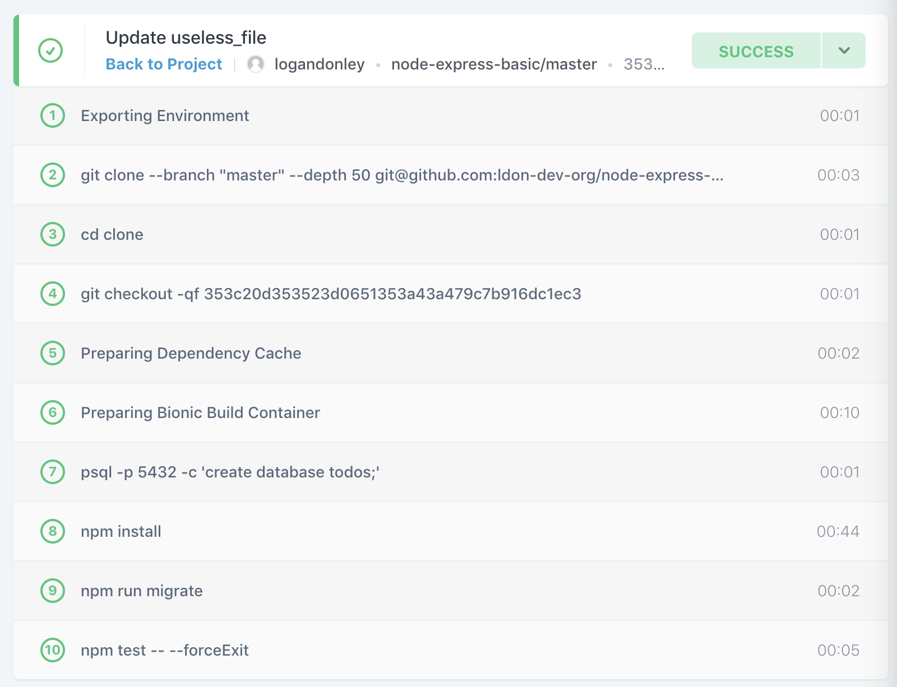
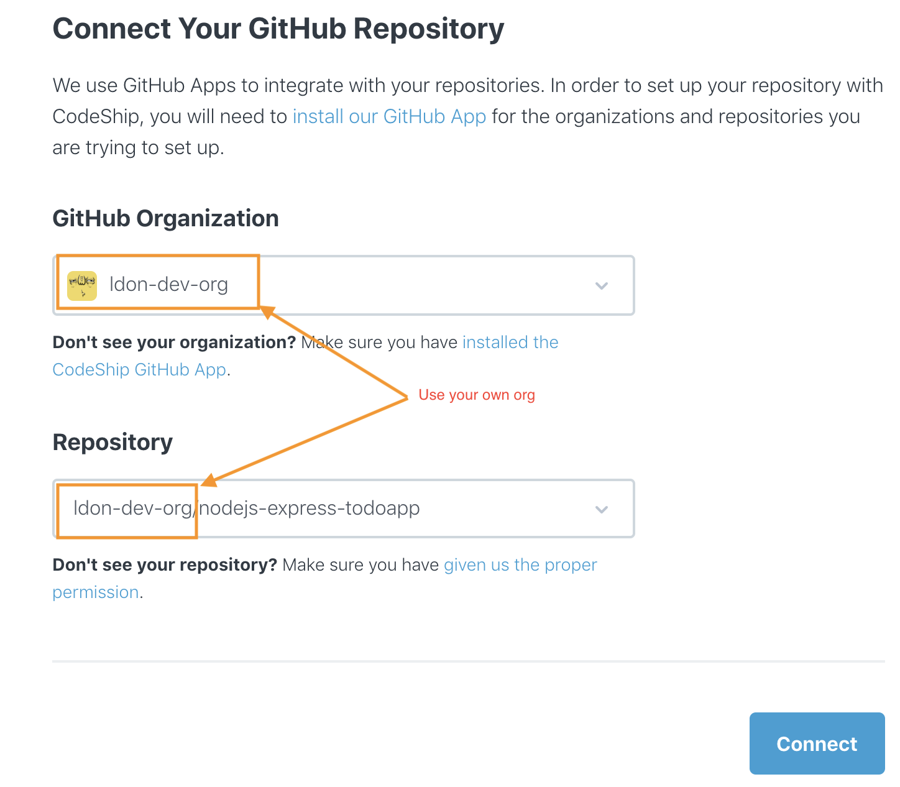
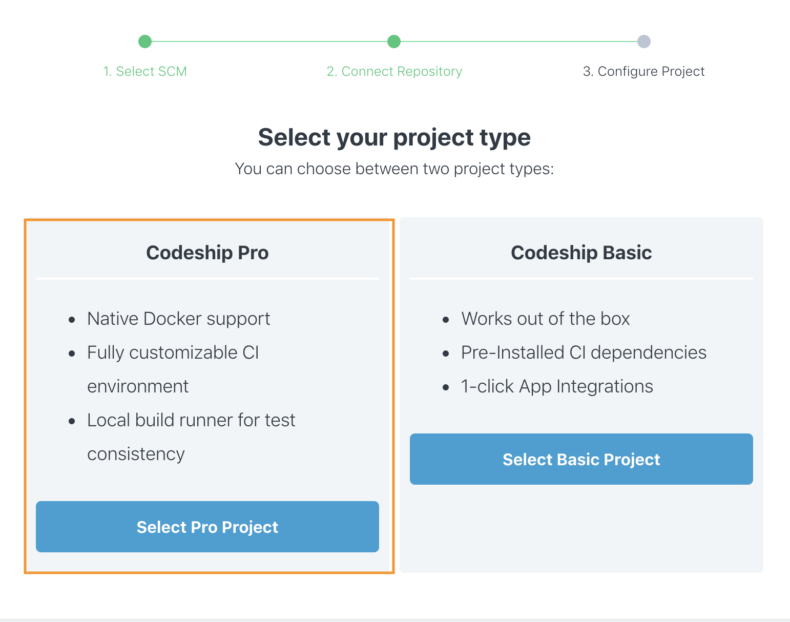

# CodeShip Workshop

In this workshop we'll be taking a look at CodeShip and use both the basic and pro modes. For more details please checkout the [documentation](https://documentation.codeship.com/).

To keep this workshop short, deployments are kept as an optional steps you are welcome to play with if you want.


## Prerequisites

* Sign up for a free account with [CodeShip](https://codeship.com) if you don't already have one.
* Sign up for an account on [GitHub](https://github.com) if you don't already have one.
* (Optional) - Sign up for a [Heroku](https://heroku.com) account. 


## Basic

Fork this [repository](https://github.com/codeship-library/node-express-basic).

Create a new basic project in CodeShip using this repository.





After creating the project in CodeShip we'll need to configure the project settings using the web interface. On the tests tab set the 'Setup Commands' to the following:

```
psql -p 5432 -c 'create database todos;'
npm install
npm run migrate
```



Next add a test pipeline (after clicking 'Add Pipeline' you will need to save changes). Configure the test pipeline to run the following:

```
npm test -- --forceExit
```


Now we need to configure a couple of environment variables to set our database address and environment tag. Head to the environment variables tab and set the following:

```
DATABASE_URL=postgres://postgres@localhost/todos
NODE_ENV=test
```


Now the pipeline is ready to go! Time to commit a change to the repo (a quick way to do this is add a blank file in the GitHub ui or just add a whitespace to the README). As soon as you commit a change you should see the project start to run.




### Optional - Continuous Deployment

You can find detailed [documentation](https://documentation.codeship.com/basic/continuous-deployment/deployment-to-heroku/) on deploying to Heroku (pages exist for most other major platforms as well). 


## Pro

Fork this [repository](https://github.com/codeship-library/nodejs-express-todoapp).

Create a new pro project in CodeShip using this repository.





Since the pro projects are configuration-as-code based and this example app already has the configuration files defined, the pipeline will run on the next commit to the repo.

There are two important files to bring your attention to:

* [codeship-services.yml](https://github.com/codeship-library/nodejs-express-todoapp/blob/master/codeship-services.yml)
* [codeship-steps.yml](https://github.com/codeship-library/nodejs-express-todoapp/blob/master/codeship-steps.yml)

Looking at the `codeship-services.yml` file (as seen below), you might notice that it looks similar to docker-compose syntax. Here you define which containers you want to make available to the pipeline.

```yaml
web-codeship-example-node:
  build: .
  depends_on:
    - postgres
  environment:
    DATABASE_URL: "postgres://todoapp@postgres/todos"
postgres:
  image: healthcheck/postgres:alpine
  environment:
    POSTGRES_USER: todoapp
    POSTGRES_DB: todos
codeship-heroku-deployment:
  image: codeship/heroku-deployment
  encrypted_env_file: deployment.env.encrypted
  volumes:
    - ./:/deploy
```

Taking a look at the `codeship-steps.yml` file below you can see a simple format which makes reference to the services defined in the other file for the individual steps.

```yaml
- type: parallel
  steps:
  - name: lint
    service: web-codeship-example-node
    command: npm run lint
  - name: tests
    service: web-codeship-example-node
    command: /bin/sh -c "npm run migrate && npm test -- --forceExit" # bash wrapper not required unless passing along env variables or combining commands
- name: deploy
  tag: master
  service: codeship-heroku-deployment
  command: codeship_heroku deploy /deploy nodejs-express-todoapp
```

Despite the deploy block above using the heroku deploy service, your pipeline is only going to be doing CI at this point since no heroku api keys have been passed. The next optional step can help you play with CD on heroku using this pipeline.

#### Jet CLI

CodeShip provides a handy cli tool which helps validate your configuration files and run the pipeline locally for testing. It also includes some helpful encrypt/decrypt functionality to safely store provider keys/tokens in your git repo.

[Details on installing](https://documentation.codeship.com/pro/jet-cli/installation/) and [using Jet CLI](https://documentation.codeship.com/pro/jet-cli/usage-overview/).

### Optional - Continuous Deployment

If you want to experiment with CD on Heroku using this test pipeline, checkout the end of the README on the sample project you forked: [nodejs-express-todoapp](https://github.com/codeship-library/nodejs-express-todoapp#continuous-deployment-to-heroku-with-codeship)

If you want more details (or to use another provider) check out the [documentation site](https://documentation.codeship.com/pro/continuous-deployment/heroku/).
